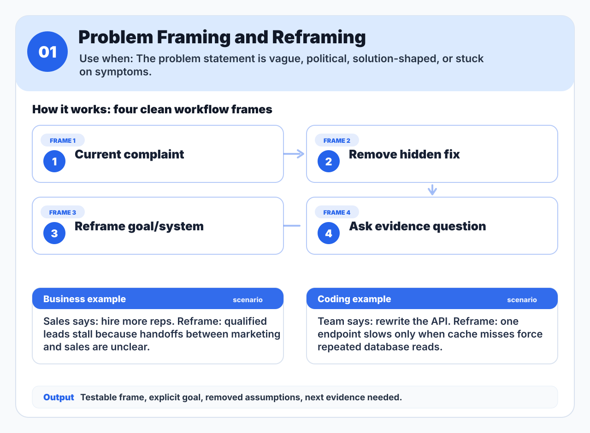
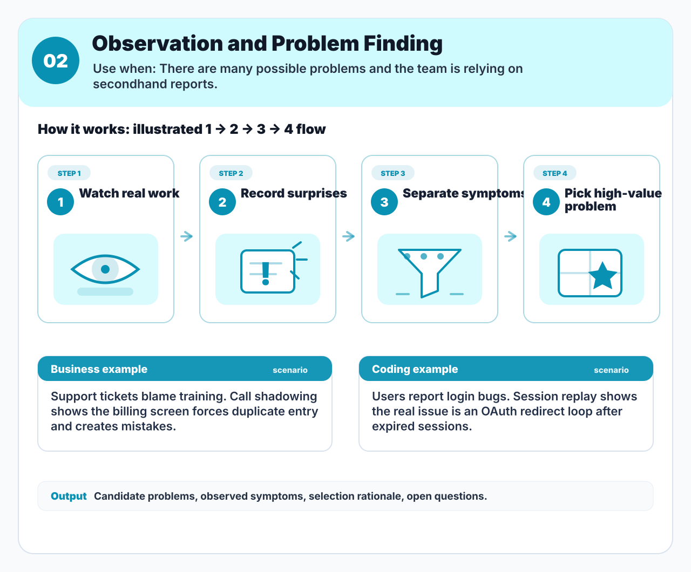
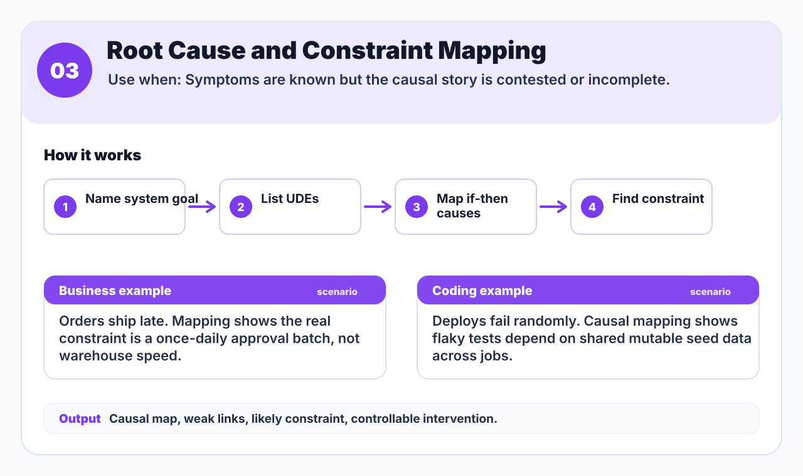
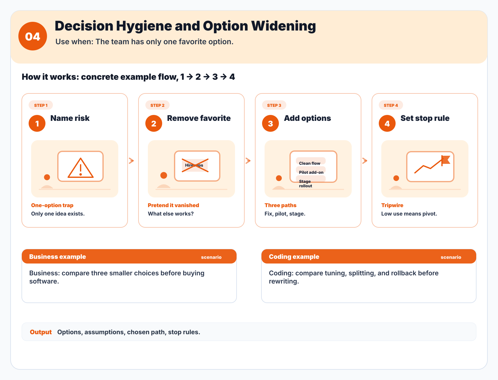
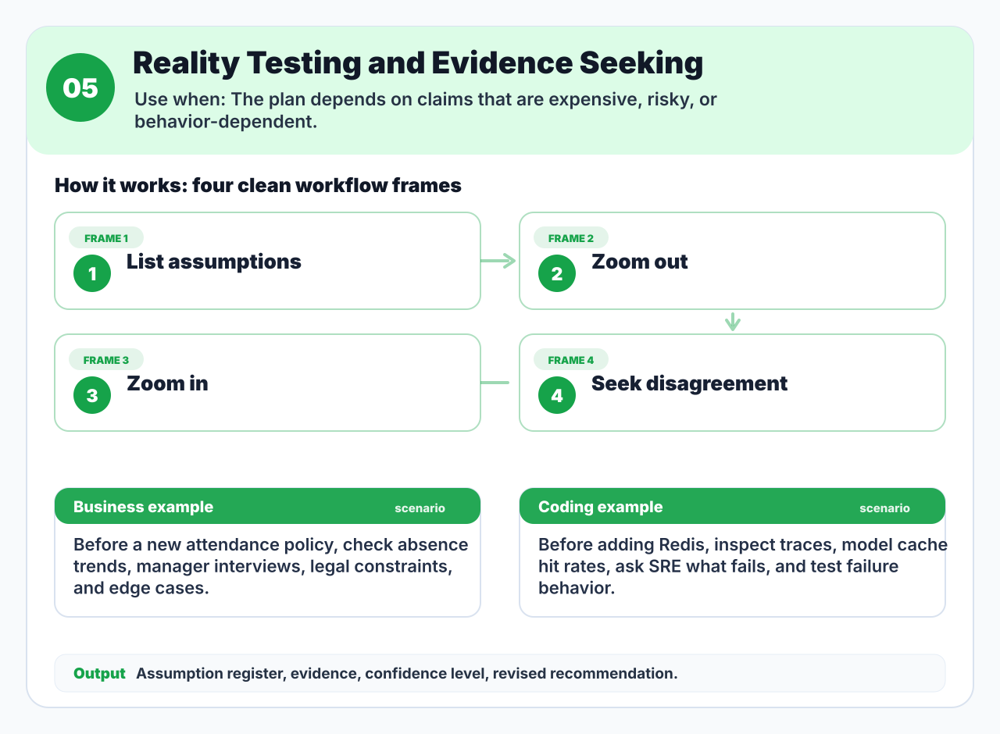
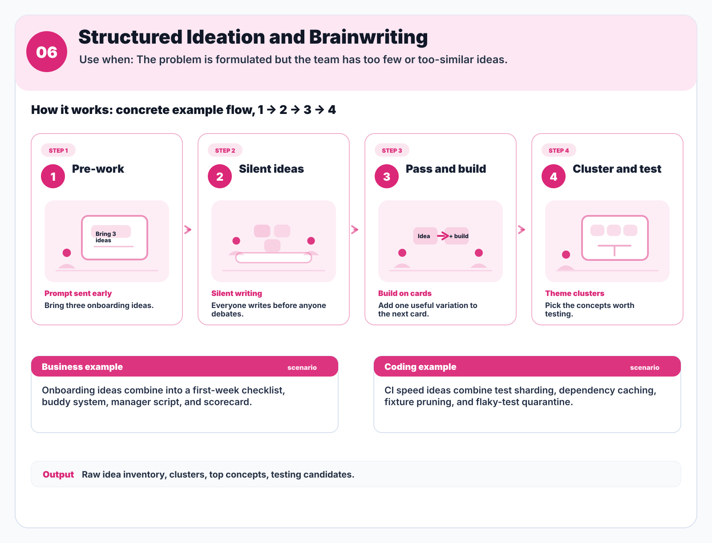
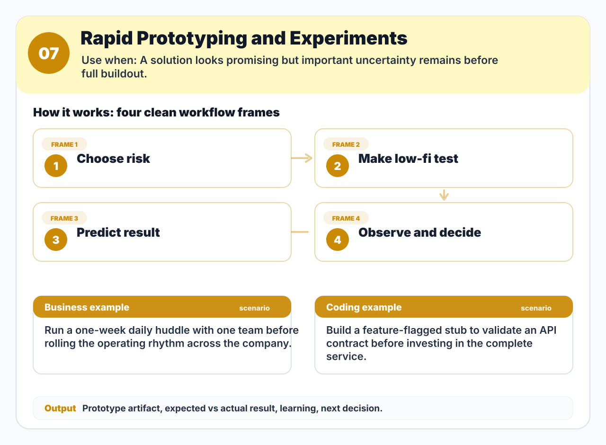
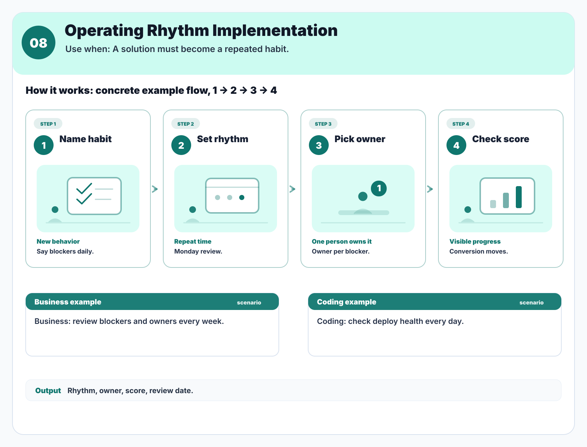
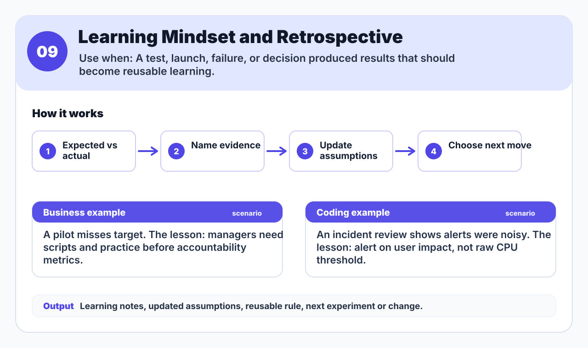

# Problem Solving System

A public, reusable skill stack for solving messy problems without jumping straight to the first attractive solution.

The system is ordered by leverage. The highest-value skills come first because they prevent wasted work: framing the right problem, observing reality, proving causes, widening options, testing assumptions, designing adoption, and only then turning a solution into durable behavior.

The 2026-05-12 research update adds one new core skill: **Stakeholder Alignment and Adoption Design**. It also refines the existing playbooks with measurable aims, contextual inquiry, active-constraint logic, outside-view decision checks, evidence appraisal, written-first ideation, MVP/PDSA experiment cards, sustainment discipline, and after-action review follow-through.

## Quickstart

Use this system when a problem is messy, political, expensive to solve, unclear, or repeatedly coming back after informal fixes.

1. Start with [Problem Framing and Reframing](skills/01-problem-framing-and-reframing/SKILL.md) unless the problem is already sharply framed.
2. Move down the numbered list until you reach the first skill that has not been done well yet.
3. Produce the output artifact from that skill before moving to the next one.
4. Treat every solution as a hypothesis until it has been reality-tested or prototyped.
5. Before rollout, use adoption design when success depends on stakeholders, workflow fit, incentives, or behavior change.
6. After action, run the after-action review skill and update the system with what was learned.

## The Skill Stack

| Rank | Skill | What It Is | When To Use It | How It Works | Output |
| --- | --- | --- | --- | --- | --- |
| 1 | [Problem Framing and Reframing](skills/01-problem-framing-and-reframing/SKILL.md) | Turns a vague, biased, or solution-shaped complaint into a measurable problem frame. | Use before any serious solution work, especially when people are arguing about fixes. | Strip out hidden causes and solutions, name the goal, add aim, boundary, baseline, and guardrail, then choose the frame that creates the clearest next evidence step. | Reframed problem, explicit goal, aim, boundary, baseline, guardrail, removed assumptions, next evidence needed. |
| 2 | [Observation and Problem Finding](skills/02-observation-and-problem-finding/SKILL.md) | Finds the right problem by watching the real workflow in context instead of relying only on opinions. | Use when there are many possible problems, secondhand complaints, or weak evidence. | Observe users or operators in the real environment, separate what people say from what they do, record interruptions, workarounds, edge cases, and rank candidates. | Candidate problem list, say/do gaps, symptoms, contextual observation notes, selection rationale. |
| 3 | [Root Cause and Constraint Mapping](skills/03-root-cause-and-constraint-mapping/SKILL.md) | Converts symptoms into a causal map and identifies the active constraint or controllable cause. | Use when symptoms are known but causes are contested. | Define the system goal, list undesirable effects, connect causes with if-then logic, avoid single-cause traps, and rank interventions by action strength. | Goal, UDE list, causal map, active constraint, action-strength ranking, controllable intervention. |
| 4 | [Decision Hygiene and Option Widening](skills/04-decision-hygiene-and-option-widening/SKILL.md) | Prevents narrow yes/no decisions and premature commitment to a favorite option. | Use before choosing a solution or when the team has only one serious option. | Name decision risks, run the vanishing option test, add alternatives, check outside-view/base-rate evidence, run a premortem, and define tripwires. | Option set, opportunity costs, outside-view check, assumptions, premortem risks, chosen option, pivot and kill rules. |
| 5 | [Reality Testing and Evidence Seeking](skills/05-reality-testing-and-evidence-seeking/SKILL.md) | Checks the claims that must be true before money, time, or trust is spent. | Use when the cost of being wrong is high or the plan depends on behavior, policy, safety, or compliance. | List critical assumptions, build an evidence register, gather zoom-out and zoom-in evidence, appraise quality, seek disagreement, and update confidence. | Assumption register, evidence register, appraisal notes, confidence level, revised recommendation. |
| 6 | [Structured Ideation and Brainwriting](skills/06-structured-ideation-and-brainwriting/SKILL.md) | Generates better options without letting dominant voices or first-solution bias take over. | Use after the problem is formulated but the solution set is shallow. | Require pre-work, write silently, pass ideas for additions and combinations, run an analogy round, cluster themes, then select finalists for testing. | Raw idea inventory, clusters, combined concepts, analogy-derived options, testing candidates. |
| 7 | [Rapid Prototyping and Experiments](skills/07-rapid-prototyping-and-experiments/SKILL.md) | Makes a solution testable quickly before a full build or rollout. | Use when a concept looks promising but important uncertainty remains. | Pick the riskiest assumption, choose MVP or PDSA style, write the experiment card, run the smallest test, and decide what changes next. | Prototype artifact, prediction, threshold, data, actual result, learning, next decision. |
| 8 | [Operating Rhythm and Sustainment](skills/08-operating-rhythm-implementation/SKILL.md) | Turns an adopted solution into repeated behavior, ownership, cadence, standard work, and measurement. | Use after adoption risks are handled and success depends on people doing different work consistently. | Translate the solution into recurring cadence, standard work, visible signals, feedback channel, owner, review date, and adjustment rule. | Cadence, roles, metric, standard work, communication script, feedback channel, review date. |
| 9 | [Learning Mindset and After-Action Review](skills/09-learning-mindset-and-retrospective/SKILL.md) | Converts results, failures, and surprises into reusable learning and system updates. | Use after tests, launches, decisions, failures, or unexpected outcomes. | Compare expected vs actual, name what helped and hurt, find why the gap happened, assign corrective action, and update the system. | Learning notes, updated assumptions, reusable rule, system update, owner, review date, next move. |
| 10 | [Stakeholder Alignment and Adoption Design](skills/10-stakeholder-alignment-and-adoption-design/SKILL.md) | Designs the human, workflow, and context conditions required for a tested solution to be adopted. | Use after prototype evidence looks promising but before operating rhythm if uptake, fit, readiness, or fidelity is uncertain. | Map stakeholders, diagnose context fit, identify the highest-leverage barriers, design supports, define adoption outcomes, and make a readiness decision. | Stakeholder map, context-fit assessment, barrier/facilitator list, adoption supports, adoption outcomes, readiness decision. |

## Recommended Learning Path

The public skill IDs stay stable, but the strongest teaching order after the research update is:

1. Skill 1: frame the measurable problem.
2. Skill 2: observe the real context.
3. Skill 3: map causes and the active constraint.
4. Skill 6: generate options with brainwriting.
5. Skill 4: narrow with decision hygiene.
6. Skill 5: test assumptions with appraised evidence.
7. Skill 7: prototype with an MVP or PDSA experiment card.
8. Skill 10: design adoption around stakeholders and context fit.
9. Skill 8: sustain the adopted behavior through operating rhythm.
10. Skill 9: run the after-action review and update the system.

## Skill Domain Visuals

Each image shows how the original nine narrated skills work and gives one business scenario plus one coding scenario. Skill 10 is currently a text-first research addition; its visual and narrated lesson should be generated in the next media pass.

### 1. Problem Framing and Reframing

### 2. Observation and Problem Finding

### 3. Root Cause and Constraint Mapping

### 4. Decision Hygiene and Option Widening

### 5. Reality Testing and Evidence Seeking

### 6. Structured Ideation and Brainwriting

### 7. Rapid Prototyping and Experiments

### 8. Operating Rhythm and Sustainment

### 9. Learning Mindset and After-Action Review

## Motion Walkthroughs

Each hyper-frame video uses the same four-panel story as the image and highlights the frames in the correct order: `1 -> 2 -> 3 -> 4`. The current media library covers the first nine narrated lessons.

For the most reliable playback, use the [GitHub Pages lesson theater](https://cryptojym.github.io/problem-solving-system/). The README keeps direct MP4 links below for download and source review. The MP4s are narrated, include AAC audio, and are generated from published transcripts. The current checked-in build uses neural `edge-tts` narration with `en-US-AndrewNeural`; OpenAI Text-to-Speech is also supported when an API key with quota is available, and macOS `say` is only the final fallback.

| Rank | Skill | Hyper-Frame Video |
| --- | --- | --- |
| 1 | Problem Framing and Reframing | [Watch MP4](assets/skill-domain-videos/01-problem-framing-and-reframing.mp4) |
| 2 | Observation and Problem Finding | [Watch MP4](assets/skill-domain-videos/02-observation-and-problem-finding.mp4) |
| 3 | Root Cause and Constraint Mapping | [Watch MP4](assets/skill-domain-videos/03-root-cause-and-constraint-mapping.mp4) |
| 4 | Decision Hygiene and Option Widening | [Watch MP4](assets/skill-domain-videos/04-decision-hygiene-and-option-widening.mp4) |
| 5 | Reality Testing and Evidence Seeking | [Watch MP4](assets/skill-domain-videos/05-reality-testing-and-evidence-seeking.mp4) |
| 6 | Structured Ideation and Brainwriting | [Watch MP4](assets/skill-domain-videos/06-structured-ideation-and-brainwriting.mp4) |
| 7 | Rapid Prototyping and Experiments | [Watch MP4](assets/skill-domain-videos/07-rapid-prototyping-and-experiments.mp4) |
| 8 | Operating Rhythm and Sustainment | [Watch MP4](assets/skill-domain-videos/08-operating-rhythm-implementation.mp4) |
| 9 | Learning Mindset and After-Action Review | [Watch MP4](assets/skill-domain-videos/09-learning-mindset-and-retrospective.mp4) |

## Operating Loop

Use the skills as a loop:

1. Frame or reframe the problem.
2. Observe the real system and find the problem worth solving.
3. Map symptoms, root causes, constraints, and controllable causes.
4. Generate options with structured ideation.
5. Widen, compare, and narrow the option set with decision hygiene.
6. Reality-test assumptions with evidence, base rates, experts, and disagreement.
7. Prototype small and learn fast.
8. Design adoption before rollout.
9. Implement through simple operating rhythms and standard work.
10. Capture learning and update the system.

## How To Choose The Next Skill

Use the earliest skill in the practical flow that has not been done well yet:

- If the problem statement already contains a solution, use Skill 1.
- If the team has not watched the real workflow, use Skill 2.
- If people disagree about causes, use Skill 3.
- If the solution set is thin, use Skill 6.
- If there is only one favored option, use Skill 4.
- If the plan depends on untested assumptions, use Skill 5.
- If debate is abstract, use Skill 7.
- If the prototype works but uptake is uncertain, use Skill 10.
- If the solution is not becoming behavior, use Skill 8.
- If the team has acted but not learned, use Skill 9.

## What Good Looks Like

A good run through this system leaves behind inspectable artifacts:

- a problem frame that can be tested
- observation notes from the real system
- a causal model with assumptions marked
- a widened option set
- evidence that can change the recommendation
- prototype results before full buildout
- an adoption plan for stakeholder fit, barriers, champions, feedback, and fidelity
- a recurring operating rhythm
- an after-action review that updates future behavior

## Source Scope

Primary sources reviewed were the Drive root docs, the CRT drawing, and high-signal class PDFs in `All Slides from Class`, including problem solving cycle, problem finding, formulation, ideation, decision hygiene, prototyping, failure/learning, and mindset material.

## Public Use

The repo is written as a practical playbook, not a transcript. It intentionally extracts reusable procedures, templates, and checks while excluding private source details and low-signal classroom noise.

For an individual problem, use one skill at a time. For a team workshop, assign a facilitator and require a visible artifact at the end of each skill before advancing.

## Repository Map

- [Detailed ordered rationale](docs/ordered-skill-system.md)
- [Source review notes](docs/source-review-notes.md)
- [Reusable skill playbooks](skills/README.md)
- [Generated skill videos](assets/skill-domain-videos/README.md)
- [Generated voiceover transcripts](assets/skill-domain-voiceovers/README.md)
- [Stakeholder Alignment and Adoption Design](skills/10-stakeholder-alignment-and-adoption-design/SKILL.md)
- [Public skill pack design](docs/plans/2026-05-07-public-skill-pack-design.md)
- [README skill images design](docs/plans/2026-05-07-readme-skill-images-design.md)
- [Hyper-frame video design](docs/plans/2026-05-07-hyper-frame-videos-design.md)
- [GitHub Pages playback design](docs/plans/2026-05-07-github-pages-playback-design.md)
- [Neural voiceover refresh](docs/plans/2026-05-07-neural-voiceover-refresh.md)
- [Video visual refinement](docs/plans/2026-05-07-video-visual-refinement.md)
- [Skill refinement and gap research](research/reports/2026-05-12-skill-refinement-and-gap-analysis.md)
